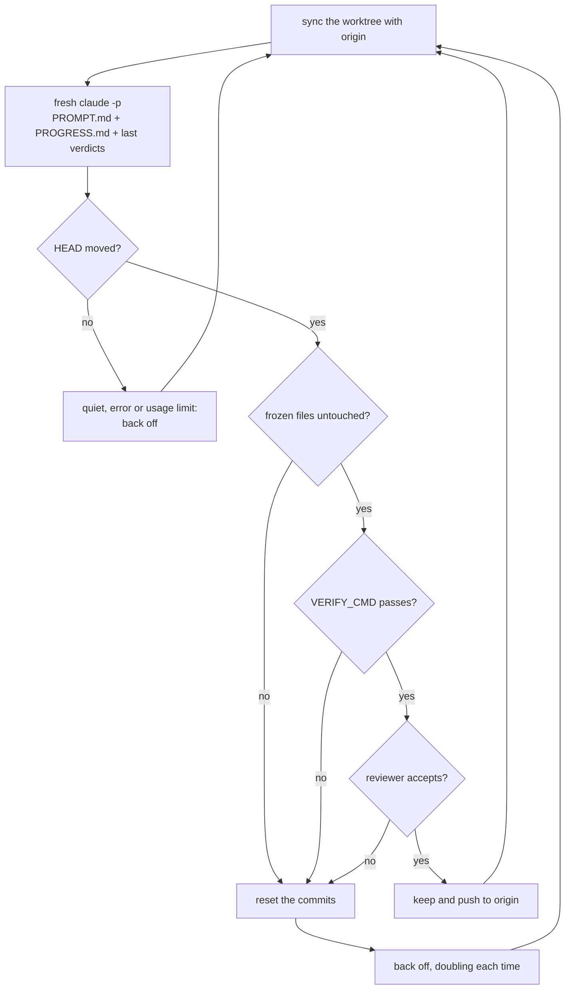

# ralph

[](https://github.com/vkuprin/ralph-harness/actions/workflows/test.yml)

A Ralph loop for Claude Code that runs for days. Every iteration is a fresh
`claude -p`, and git, not the model, decides what shipped.

It is a few hundred lines of bash. It needs `bash`, `git` and the `claude` CLI,
works on macOS and Linux, and installs nothing.

```bash
git clone https://github.com/vkuprin/ralph-harness && cd ralph-harness
./ralph new audit ~/code/my-app     # scaffold a loop in ~/.claude/ralph/audit
$EDITOR ~/.claude/ralph/audit/PROMPT.md
./ralph start audit
./ralph status
```

To run it from anywhere, link it onto your PATH. It follows the link back to the
checkout, so `git pull` there updates it:

```bash
ln -s "$PWD/ralph" ~/.local/bin/ralph
```

## What makes it different

The idea is Geoffrey Huntley's: [Ralph is a bash loop](https://ghuntley.com/ralph/)
that feeds an agent the same prompt until the work is done. There are many
implementations. This one is built for a particular kind of job: open-ended work
with no task list, such as an audit, a clean-up or a measurement campaign, running
unattended on your machine for days.

Every iteration starts with an empty context. Iteration 40 starts as clean as
iteration 1 and reads `PROGRESS.md`, notes a predecessor wrote for a stranger,
instead of dragging a transcript behind it. On the job this was written for (11
iterations over 9 hours, each parsing tens of thousands of selectors across 31
pages), the session that merely *watched* the loop compacted twice. A loop inside
one session would have compacted sooner, and every compaction throws away the
detail the next measurement needs.

The model does not decide what counts. A model that thinks it is finished cannot
end the loop, and one that does nothing shows up in the log within one iteration.
The loop asks git whether HEAD moved. If you let it, it then runs your own check
and a read-only reviewer on the new commits and resets the ones that fail.

An iteration that finds nothing makes the loop look less often. It does not stop
it, because an hour that found nothing says nothing about the next hour.

You can redirect it while it runs. `ralph steer` reaches the iteration in flight
at its next tool call, and every iteration after that.

The cost is worth naming: the agent knows only what the previous one bothered to
write down. `PROGRESS.md` discipline is the whole ballgame, which is why the
template spends most of its words on it.

## Use something else when

| If you want | Use |
| --- | --- |
| a task with an end, finished in the session you are watching | Claude Code's built-in [`/goal`](https://code.claude.com/docs/en/goal) or the official [`ralph-loop` plugin](https://github.com/anthropics/claude-code/tree/main/plugins/ralph-wiggum) |
| a PRD or task list worked through overnight | [snarktank/ralph](https://github.com/snarktank/ralph) or [PageAI-Pro/ralph-loop](https://github.com/PageAI-Pro/ralph-loop) |
| every change to go through a pull request and CI | [Continuous Claude](https://github.com/AnandChowdhary/continuous-claude) |
| one file tuned against one number | [karpathy/autoresearch](https://github.com/karpathy/autoresearch) |
| the loop to run in the cloud on a schedule | [githubnext/autoloop](https://github.com/githubnext/autoloop) |

How they compare on the two things this harness is built around:

| | Each iteration runs in | Who decides a change counts |
| --- | --- | --- |
| official `ralph-loop` plugin | the same session (a Stop hook re-feeds the prompt) | the model prints a completion promise |
| `/goal` | the same session | a small model reads the transcript |
| snarktank/ralph | a new process | the model prints `<promise>COMPLETE</promise>` |
| Continuous Claude | a new process | CI on a PR per iteration; the harness commits everything with `git add .` |
| autoresearch | one long agent session | a frozen metric: keep or revert |
| githubnext/autoloop | a GitHub Actions run, every 6 hours by default | the model compares the metric with the best so far |
| this harness | a new process | git, your `VERIFY_CMD`, and a read-only reviewer |

## How an iteration goes



1. The prompt is `PROMPT.md` (re-read every time, so edits land on the next
   iteration), then `PROGRESS.md`, then the last ten harness verdicts. Where
   `PROGRESS.md` claims something shipped and the verdicts say it was reset,
   the verdicts win.
2. The agent works in its own git worktree on branch `ralph/<name>`, next to your
   repository. It commits; it cannot push.
3. When it exits, the harness throws away anything left uncommitted. An
   uncommitted edit to a frozen file therefore cannot help a commit pass.
4. The new commits go through the gates in order. The first failure resets the
   branch to where the iteration started.
5. Kept commits are rebased onto origin if someone else pushed meanwhile, verified
   again, and pushed by the harness.
6. Every iteration leaves one row in `results.tsv`, which `ralph results` prints:

| Verdict | Meaning |
| --- | --- |
| `keep` | shipped |
| `keep:unreviewed` | shipped; `VERIFY_CMD` passed but the reviewer gave no verdict |
| `quiet` | nothing committed |
| `ratelimit` | the run hit a limit (5-hour, weekly, credit, overloaded API); the loop waits and tries the same iteration again |
| `timeout`, `error` | the agent was killed after `ITER_TIMEOUT`, or crashed |
| `revert:frozen` | a commit touched a frozen file |
| `revert:verify` | `VERIFY_CMD` failed |
| `revert:review` | the reviewer rejected the change, with its reason |
| `revert:review-unavailable` | no reviewer verdict and no `VERIFY_CMD`, so nothing vouched for it |
| `revert:history` | the agent left `ralph/<name>` or rewrote its history |
| `drop:conflict`, `drop:reverify` | kept work no longer applied, or no longer passed, on top of a new origin; saved under `refs/ralph/dropped/` |
| `drop:interrupted` | on start: commits from an iteration that was killed before it was judged; saved under `refs/ralph/dropped/` |

Limits heal on their own. When a run ends on a plan limit, an overloaded API or an
API key out of credit, the loop sleeps `RATE_LIMIT_SLEEP` and tries the same
iteration again, as often as it takes. A limited call fails at once without using
quota, so the retries are free, and they do not count toward `MAX_ITER`. The
reviewer waits the same way instead of letting a commit through unreviewed, but
only `REVIEW_LIMIT_TRIES` times: it waits holding a commit that no gate has
judged, and a limit that never clears (a spent credit balance) would park the
loop on it for good. After that the iteration takes the reviewer-unavailable
path above — `keep:unreviewed` if `VERIFY_CMD` vouched for it, otherwise
`revert:review-unavailable`. If
the loop itself is killed (a reboot, `ralph stop` mid-iteration), commits the
unfinished iteration made are set aside at the next start rather than pushed
unjudged.

After `ESCALATE_AFTER` failed or reverted iterations in a row, the prompt tells
the agent to stop retrying and pivot. After twice as many, it tells it to write the
blocker under "Needs a decision" and move on. The loop itself never gives up on
this; it backs off.

## Commands

```bash
./ralph                       # a short guide, then the loops you have
./ralph new <name> <repo>     # scaffold a loop from template/
./ralph start <name>          # run it in the background
./ralph status [name]         # running or not, iterations, verdict counts, HEAD
./ralph review <name> [n]     # what it shipped, what the gates threw away, what waits to merge
./ralph results <name> [n]    # the last n verdicts as a table
./ralph log <name> [n]        # the last n lines of the log
./ralph tail <name>           # follow the log
./ralph steer <name> "text"   # redirect it, starting with the iteration in flight
./ralph edit <name>           # open PROMPT.md in $EDITOR
./ralph migrate <name>        # convert a loop from before config.sh to the current layout
./ralph stop <name>           # stop the loop and everything the agent started
```

Loops live in `$RALPH_HOME`, which defaults to `~/.claude/ralph`. A loop directory
holds `config.sh`, `PROMPT.md` (the job) and `PROGRESS.md` (the memory), plus the
log, the verdicts and the archive the harness writes. None of it goes into your
repository: `PROMPT.md` tends to carry hostnames and per-project rules, and
`PROGRESS.md` grows into a long journal. Only the newest `PROGRESS_KEEP` Log
entries stay in it; older ones move to `PROGRESS-archive.md`, which the agent can
read but which is not put into every prompt.

That cap reads a `## Log` heading with `### ` entries under it, and the agent is
what writes both — rename either, or write one enormous entry, and it has
nothing to count. So the bound that matters is on the prompt rather than on the
file: at most `PROGRESS_MAX_BYTES` of `PROGRESS.md` is injected, and the first
bytes are the ones kept, because the newest entry goes at the top. The file
itself is never truncated — it is the loop's whole memory — and the prompt says
where to read the part that was cut. If you see that notice, the entry cap has
stopped working and `PROGRESS.md` wants tidying by hand.

The log is bounded the same way. Every agent's whole output goes into `ralph.log`,
so a loop left running for days would write gigabytes into one file; instead it
rotates between iterations once it passes `LOG_MAX_BYTES`, keeping `LOG_KEEP`
older files as `ralph.log.1` and up. `ralph status`, `ralph log` and `ralph tail`
read the rotated files too, however many there are, so the iteration counts do
not reset when it rotates. Lower `LOG_KEEP` and the files above the new number
are removed at the next rotation, so the total stays where you set it.

`ralph.log` is the whole story: the harness's own errors go there as well, not
only the agent's output. `ralph start` also leaves a `ralph.out` beside it with
the progress lines in it, but nothing you need is there alone.

What the gates throw away is bounded too, and that one grows in your repository
rather than in the loop directory. A reverted or dropped commit is kept under
`refs/ralph/`, and that ref is the only thing left keeping it reachable — so
while they accumulate, `git gc` can never reclaim the objects, and a long run
pins one whole tree per thrown-away iteration for good. The newest `REF_KEEP` of
each kind are kept and the rest are let go, which is all `git gc` needs to shrink
the repository back.

A loop that ends by `kill -9`, the OOM killer or a reboot leaves its `ralph.pid`
and `ralph.lock` behind, and the kernel later hands that number to some unrelated
process. Neither file is believed on the number alone: the process holding it has
to be running this loop's script, or it is treated as gone. Otherwise `ralph
status` reported a dead loop as running, `ralph start` refused to start it ever
again, and `ralph stop` killed the stranger's process group.

A loop from before `config.sh` existed keeps its settings as variables near the top
of its own `ralph.sh` and writes no `ralph.pid`. `ralph status` and the guide list
one anyway, marked `old layout`, with the repository it works in, its iteration
counts, and whether a process is running it — found in the process list, since
there is no PID file. The other commands need `config.sh`.

`ralph migrate <name>` gives it one. It copies the settings that loop actually had
(`REPO`, `MAX_ITER`, `QUIET_STOP`) into `config.sh` and renames the old script to
`ralph.sh.old`; `PROMPT.md`, `PROGRESS.md` and the log are left alone. Everything
added since keeps its harness default, which is what that loop already did: no
worktree, no gates, no push. So the migrated loop behaves as before, and turning
the gates on afterwards is a matter of editing `config.sh`. It refuses while the
loop is running, and refuses a loop that already has a `config.sh`.

## Configuration

`config.sh` in the loop directory is plain bash, sourced at start. `ralph new`
writes one with the values in the first column. A setting left out takes the value
in the second, which is how a loop written for an earlier version keeps behaving
the same.

| Setting | `ralph new` | If unset | What it does |
| --- | --- | --- | --- |
| `REPO` | your repo | required | the checkout to work on |
| `MODEL` | `opus` | `opus` | model for the agent and the reviewer |
| `MAX_ITER` | `500` | `500` | hard ceiling on iterations |
| `QUIET_STOP` | `0` | `0` | stop after this many silent iterations in a row; `0` never stops. Use `3` for a finite list |
| `QUIET_SLEEP` | `1200` | `1200` | seconds to wait after a silent iteration |
| `STEP_SLEEP` | `30` | `30` | seconds between iterations |
| `ADD_DIRS` | | `()` | extra directories the agent may read |
| `WORKTREE` | `1` | `0` | work in a harness-owned worktree; every gate needs it |
| `WORKTREE_DIR` | | `<repo>-ralph-<name>` next to the repo | where the worktree goes; a path holding anything but a worktree of `REPO` is refused |
| `BRANCH` | `main` | `main` | the branch the worktree starts from and pushes to |
| `PUSH` | `1` | `0` | push kept commits to `origin/$BRANCH`; with `0` they wait on `ralph/<name>` for you. With no `origin` it says so once and behaves as `0` |
| `SETUP_CMD` | | | run once in a new worktree (`npm ci`, copy `.env`). If it fails the worktree and its branch go, so the next start runs it again |
| `VERIFY_CMD` | | | your check, run after every commit; failing resets the commit |
| `VERIFY_TIMEOUT` | `1800` | `1800` | seconds `VERIFY_CMD` may take |
| `FROZEN` | `()` | `()` | paths a commit may not touch |
| `REVIEW` | `1` | `0` | a read-only reviewer judges each commit |
| `ITER_TIMEOUT` | `7200` | `7200` | seconds one agent run may take |
| `RATE_LIMIT_SLEEP` | `1800` | `1800` | wait before retrying after a limit |
| `RATE_LIMIT_RE` | | see `ralph.sh` | what counts as a limit; extend it with `RATE_LIMIT_RE="$RATE_LIMIT_RE\|your proxy's message"` |
| `REVIEW_LIMIT_TRIES` | `12` | `12` | times a limited reviewer is asked again before the iteration gives up on the review; `0` waits forever |
| `ERROR_SLEEP` | `300` | `300` | wait after a failure or reset, doubling in a row up to an hour |
| `ERROR_STOP` | `0` | `0` | stop after this many crashes or timeouts in a row; `0` never stops |
| `ESCALATE_AFTER` | `3` | `3` | failures in a row before the prompt says pivot |
| `PROGRESS_KEEP` | `8` | `8` | Log entries kept in `PROGRESS.md`; `0` keeps all |
| `PROGRESS_MAX_BYTES` | `120000` | `120000` | most of `PROGRESS.md` put into one prompt, first bytes kept; the file is never touched; `0` injects all of it |
| `LOG_MAX_BYTES` | `10000000` | `10000000` | rotate `ralph.log` once it passes this between iterations; `0` never rotates |
| `LOG_KEEP` | `3` | `3` | rotated logs kept, `ralph.log.1` up, no ceiling; lowering it prunes the rest; `0` throws the old one away |
| `REF_KEEP` | `20` | `20` | thrown-away commits kept under `refs/ralph/reverted/` and `refs/ralph/dropped/`, newest first, each counted separately; `0` keeps every ref and `git gc` can never reclaim them |
| `LIVE_STEER` | `1` | `1` | let `ralph steer` reach the iteration in flight |
| `CLOSING` | | see `ralph.sh` | the last line of every prompt |

Two settings matter more than the rest. `VERIFY_CMD` is the strongest gate you
can give the loop, because it is a check you own and the model cannot edit. Put
the measurement script and the fixtures it reads in `FROZEN`, or the agent can
pass the check by moving it. `MAX_ITER` is the one thing standing between a bug
in your prompt and a loop that runs all week.

## Safety

The agent runs with `--dangerously-skip-permissions`: it can run any command your
user can. The harness narrows what that can do to your code, not to your machine.

- With `WORKTREE=1` it never touches your own checkout, and everything that
  resets commits happens only inside its own worktree. A `WORKTREE_DIR` that
  holds a checkout of some other repository is refused at start rather than
  reset: the loop only discards work on a worktree of its own `REPO`.
- With `PUSH=1` the agent's own push to this repository fails, however it spells
  it; only the harness pushes, and only what passed the gates. The block is keyed
  on the remote's URL, so a push to some other repository — the throwaway remote
  a test suite makes for itself, say — still works.
- The reviewer runs with `claude -p --restricted --tools "Read,Grep,Glob"`: no
  shell, no settings or MCP servers from your machine or from the repository, and
  permission prompts are denied rather than left hanging.
- Every run (agent, `VERIFY_CMD`, reviewer, push) has a timeout and its own
  process group, so a timeout or `ralph stop` also ends the test runners and dev
  servers it started.

If the loop can reach production, say in `PROMPT.md` what it must never write
to. For stronger isolation, run the whole thing inside a container or a VM.

## Tests

```bash
tests/run.sh                        # with the bash on PATH
RALPH_BASH=/bin/bash tests/run.sh   # macOS: the loop must also run on bash 3.2
```

A stub stands in for `claude` and a bare repository for origin, so the tests need
no network and no credentials. They drive the real loop through every verdict
above, the CLI, the escalation, the progress cap and the steering hook. CI runs
them on Linux and on macOS.

## Credits

- [Geoffrey Huntley](https://ghuntley.com/ralph/) for the technique.
- [karpathy/autoresearch](https://github.com/karpathy/autoresearch) for
  keep-or-revert against a check the agent cannot edit.
- [Continuous Claude](https://github.com/AnandChowdhary/continuous-claude) for the
  reviewer pass and worktree ideas.
- [anthropics/cwc-long-running-agents](https://github.com/anthropics/cwc-long-running-agents)
  for the steering hook; `hooks/steer.sh` is adapted from it (Apache-2.0).
- [ralph-tui](https://github.com/subsy/ralph-tui) for keeping only recent progress
  in the prompt.
- [tcc-autoresearch](https://github.com/the-cloud-clockwork/tcc-autoresearch) for
  escalating after repeated failure.
- Anthropic's [Effective harnesses for long-running agents](https://www.anthropic.com/engineering/effective-harnesses-for-long-running-agents),
  which describes the same progress-file-plus-git design.

## License

MIT, except `hooks/steer.sh` (Apache-2.0). See [LICENSE](LICENSE).
