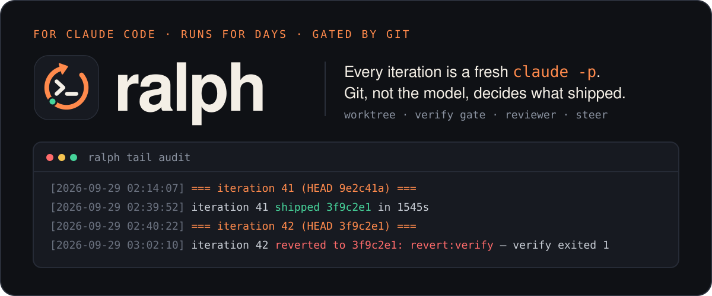
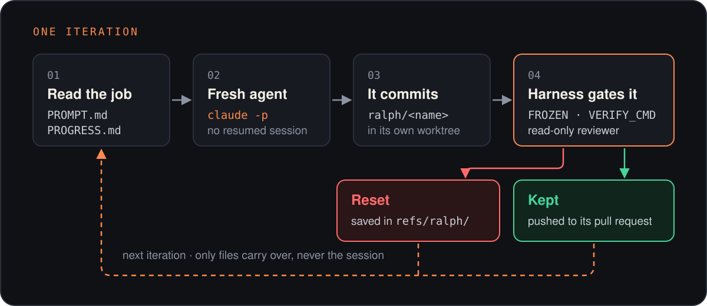
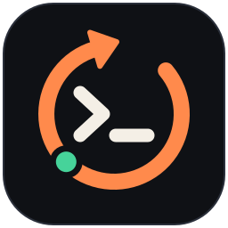

<p align="center">
  
</p>

<p align="center">
  <a href="https://www.npmjs.com/package/@vkuprin/ralph-harness"></a>
  <a href="https://github.com/vkuprin/homebrew-tap"></a>
  <a href="https://github.com/vkuprin/ralph-harness/actions/workflows/test.yml"></a>
  <a href="https://bun.sh"></a>
  
  <a href="LICENSE"></a>
</p>

<p align="center">
  <a href="#install">Install</a> ·
  <a href="#quick-start">Quick start</a> ·
  <a href="#how-it-works">How it works</a> ·
  <a href="#real-runs">Real runs</a> ·
  <a href="#commands">Commands</a> ·
  <a href="#options">Options</a> ·
  <a href="#safety">Safety</a>
</p>

A Ralph loop for Claude Code that runs for days. Every iteration is a fresh
`claude -p` that reads the job from `PROMPT.md` and its own notes from
`PROGRESS.md`, does some work and commits. Then git and your own commands decide
whether that commit ships. What the model says about its work never counts.

Needs `bun`, `git` and the `claude` CLI. macOS, Linux and [Windows](#windows).
No npm dependencies.

## How it works

<p align="center">
  
</p>

- Every iteration is a new `claude -p` reading `PROMPT.md` and `PROGRESS.md`. It
  commits and rewrites `PROGRESS.md`; nothing else carries over.
- The agent never pushes. The harness checks each new commit (`FROZEN`,
  `VERIFY_CMD`, reviewer), resets the ones that fail, and pushes the rest.
- An iteration that ships nothing makes the loop wait longer, not stop, unless
  `QUIET_STOP` says so.
- A usage limit is waited out and doesn't count toward `MAX_ITER`.
- `ralph stop` stops the loop right away, together with any tests or servers
  the agent started. When the loop itself was killed outright (`kill -9`, a
  crash), it stops the agent the loop left running (not on Windows yet).

## Real runs

ralph worked on this repository in a loop for 18 hours on September 21: 24
iterations, 22 commits kept, 2 reset. `VERIFY_CMD` reset one that broke the
tests. The reviewer reset the other: it added a rule to `AGENTS.md` saying every
printed hint is now quoted, while the same unquoted hint was still live in the
script. The next iteration shipped the whole fix
([c423e1e](https://github.com/vkuprin/ralph-harness/commit/c423e1e)).

## Install

**[Homebrew](https://github.com/vkuprin/homebrew-tap)**

```bash
brew install vkuprin/tap/ralph
```

**[npm](https://www.npmjs.com/package/@vkuprin/ralph-harness).** ralph runs on
bun, so bun has to be on PATH either way:

```bash
bun add -g @vkuprin/ralph-harness        # or: npm i -g @vkuprin/ralph-harness
```

**From source**

```bash
git clone https://github.com/vkuprin/ralph-harness && cd ralph-harness
ln -s "$PWD/bin/ralph" ~/.local/bin/ralph
```

Optional: the `ralph-new` skill in any Claude session (`ralph setup` doesn't
need it). As a Claude Code plugin, where it's `/ralph-harness:ralph-new`:

```
/plugin marketplace add vkuprin/ralph-harness
/plugin install ralph-harness@ralph-harness
```

Or link it from the install for `/ralph-new`:

```bash
ln -s "$(brew --prefix)/opt/ralph/libexec/skills/ralph-new" ~/.claude/skills/ralph-new                   # Homebrew
ln -s ~/.bun/install/global/node_modules/@vkuprin/ralph-harness/skills/ralph-new ~/.claude/skills/ralph-new # bun
ln -s "$(npm root -g)/@vkuprin/ralph-harness/skills/ralph-new" ~/.claude/skills/ralph-new                 # npm
ln -s "$PWD/skills/ralph-new" ~/.claude/skills/ralph-new                                                  # source
```

### Windows

ralph runs natively on Windows 10 and 11. It needs three things:

- **[Git for Windows](https://git-scm.com/download/win).** It provides `git`, and
  its Git Bash runs your `VERIFY_CMD`, `HEALTH_CMD`, `NOTIFY_CMD` and the other
  `*_CMD` settings. Claude Code uses the same bash for its own shell commands.
- **[bun](https://bun.sh)**: `powershell -c "irm bun.sh/install.ps1 | iex"`.
- **Claude Code's native build** (`claude.exe`), from the
  [install page](https://code.claude.com). The `claude.cmd` that
  `npm i -g @anthropic-ai/claude-code` installs is a batch file, and the harness
  won't start one: cmd.exe would read the agent's arguments. A loop refuses to
  start if that's the `claude` on PATH.

Then install from npm and use it from PowerShell, cmd or Git Bash:

```powershell
bun add -g @vkuprin/ralph-harness        # or: npm i -g @vkuprin/ralph-harness
ralph setup
```

What works differently on Windows:

- `*_CMD` settings run in Git Bash. ralph finds it next to `git.exe`. To use
  another bash, set `RALPH_BASH` (or Claude Code's `CLAUDE_CODE_GIT_BASH_PATH`)
  to its full path. The `bash` on a Windows PATH is often WSL's, and ralph
  doesn't use that one.
- Windows has no process groups and no TERM signal. `ralph stop` asks the loop to
  stop through a `ralph.stop` file in its directory; the loop then kills the
  agent's whole process tree (`taskkill /T`), logs where it stopped, and exits.
  A loop that doesn't answer within 15s is killed together with its tree.
- `ralph tail` follows the log itself, and `ralph edit` opens `notepad` when
  `EDITOR` isn't set.
- Loop names and repo paths can't contain characters Windows forbids in file
  names (`< > : " | ? *`).

WSL works too. There ralph is simply the Linux version, and the loop and the
repository live in the Linux filesystem.

To upgrade, run `brew upgrade ralph`, `bun add -g @vkuprin/ralph-harness@latest`
or `git pull`, then restart any running loops (`ralph stop <name>`, `ralph start <name>`).
A running loop keeps the files it started with, and Homebrew deletes the old
version's files. What changed is in [CHANGELOG.md](CHANGELOG.md) and on the
[releases page](https://github.com/vkuprin/ralph-harness/releases).

## Quick start

```bash
cd ~/code/my-app
ralph setup                  # Claude asks how the loop should run, then creates it
```

Or by hand:

```bash
ralph new audit ~/code/my-app --set 'VERIFY_CMD=npm test'
ralph edit audit             # write the job into PROMPT.md
ralph start audit
ralph status
```

## Commands

| Command | What it does |
| --- | --- |
| `ralph` | short guide and your loops |
| `ralph setup` | open Claude Code here with the setup skill; it asks questions and scaffolds the loop |
| `ralph new` | same as `ralph setup` |
| `ralph new <name> <repo> [--set KEY=VALUE]...` | scaffold a loop, with settings written into its `config.json` |
| `ralph edit <name>` | open `PROMPT.md` in `$EDITOR` |
| `ralph start <name>` | run it in the background |
| `ralph stop <name>` | stop the loop and everything the agent started |
| `ralph status [name]` | running or not, iterations, verdicts, HEAD |
| `ralph review <name> [n]` | what it shipped, what it threw away, what waits to merge |
| `ralph results <name> [n]` | last n verdicts as a table |
| `ralph log <name> [n]` | last n log lines |
| `ralph tail <name>` | follow the log |
| `ralph steer <name> "text"` | redirect it, starting with the iteration in flight |
| `ralph migrate <name>` | convert an old bash-harness `config.sh` to `config.json` |
| `ralph --version` | the installed version |

A loop lives in `~/.claude/ralph/<name>/` (`$RALPH_HOME`): `config.json`,
`PROMPT.md` (the job), `PROGRESS.md` (its memory), `ralph.log`, `results.tsv`.

## Options

Set them in the loop's `config.json` (JSON with comments), or when creating it with
`ralph new … --set KEY=VALUE`. Read once at start: restart to apply. An unknown key
or a wrong type refuses the start. The defaults below are what `ralph new` writes; a
key left out of the file entirely is off for `WORKTREE`, `PUSH`, `PR_DRAFT`, `REVIEW`,
`LIMIT_RESET` and `CHURN_AT`.

<details>
<summary><b>Loop</b></summary>

| Setting | Default | What it does |
| --- | --- | --- |
| `REPO` | your repo | the checkout to work on, absolute path. Required |
| `MODEL` | `"opus"` | model for the agent and the reviewer |
| `PLAN_FIRST` | `false` | start each iteration in Claude's plan mode; the harness approves the plan and the same run carries it out |
| `MAX_ITER` | `500` | hard ceiling on iterations; the loop ends right after the last one, with no pause and no wait for `ACTIVE_HOURS` |
| `QUIET_STOP` | `0` | stop after this many iterations in a row ship nothing; `0` never |
| `QUIET_SLEEP` | `1200` | seconds to wait after an iteration that shipped nothing |
| `STEP_SLEEP` | `30` | seconds between iterations that shipped |
| `ITER_TIMEOUT` | `7200` | seconds one agent run may take |
| `DONE_CMD` | `""` | your "job is done" check, before every iteration; exit 0 stops the loop |
| `ACTIVE_HOURS` | `""` | local hours iterations may start in, like `"22-08"`; empty is any time |
| `ADD_DIRS` | `[]` | extra directories the agent may read |
| `DENY` | `[]` | tool patterns the agent may never use, like `"Bash(ssh *)"` |
| `LIVE_STEER` | `true` | let `ralph steer` reach the iteration in flight |
| `ESCALATE_AFTER` | `3` | failures in a row before the prompt says pivot |
| `CLOSING` | names `PROGRESS.md` | last line of every prompt |

</details>

<details>
<summary><b>Gates</b></summary>

| Setting | Default | What it does |
| --- | --- | --- |
| `WORKTREE` | `true` | work in a harness-owned worktree on `ralph/<name>`; every gate needs it |
| `WORKTREE_DIR` | next to the repo | where the worktree goes |
| `SETUP_CMD` | `""` | run once in a new worktree, like `npm ci` |
| `VERIFY_CMD` | `""` | your check after every commit; failing resets the commit |
| `VERIFY_TIMEOUT` | `1800` | seconds `VERIFY_CMD` may take |
| `FROZEN` | `[]` | paths a commit may not touch |
| `REVIEW` | `true` | a read-only Claude reviewer judges each commit |
| `REVIEW_MODEL` | `MODEL` | the reviewer's model |
| `REVIEW_LIMIT_TRIES` | `12` | times a rate-limited reviewer is retried; `0` forever |
| `HEALTH_CMD` | `""` | your check of the running system, before every iteration; while it fails, fixing it leads the prompt |
| `HEALTH_TIMEOUT` | `300` | seconds `HEALTH_CMD` may take |
| `CHURN_AT` | `4` | flag files changed by this many of the last `CHURN_WINDOW` kept iterations; `0` off |
| `CHURN_WINDOW` | `8` | kept iterations `CHURN_AT` counts over |
| `CHURN_IGNORE` | `[]` | paths left out of that count |

</details>

<details>
<summary><b>Push and pull requests</b></summary>

| Setting | Default | What it does |
| --- | --- | --- |
| `BRANCH` | `"main"` | the base branch |
| `PUSH` | `"pr"` | `"pr"` pushes `ralph/<name>` and keeps one pull request open; `true` pushes kept commits straight to `BRANCH`; `false` stays local |
| `PUSH_CONFIRM` | `""` | required with `PUSH` `true`: the name of `BRANCH` again. Whatever deploys `BRANCH` deploys every kept commit, so the loop refuses to start without it |
| `PR_DRAFT` | `true` | with `"pr"`, open the pull request as a draft and mark it ready when the loop ends by itself; with one loop per stage, nobody merges a stage half done |
| `PR_MERGE` | `false` | with `"pr"`, merge the pull request when the loop ends by itself and every check passes |
| `PR_MERGE_METHOD` | `"merge"` | `"merge"`, `"squash"` or `"rebase"` |
| `PR_MERGE_WAIT` | `3600` | seconds to wait for checks still running |
| `PR_MERGE_POLL` | `30` | seconds between two looks at the checks |
| `LAND_OK_CMD` | `""` | your check that `BRANCH` may move now, like "no data load running in production"; while it fails, a push (`true`) or a merge (`PR_MERGE`) waits, asking every `ACTIVE_POLL` seconds |
| `LAND_OK_TIMEOUT` | `300` | seconds `LAND_OK_CMD` may take |

</details>

<details>
<summary><b>Limits and errors</b></summary>

| Setting | Default | What it does |
| --- | --- | --- |
| `RATE_LIMIT_SLEEP` | `1800` | wait before retrying after a limit |
| `LIMIT_RESET` | `true` | wait until the reset time the limit message names instead |
| `RATE_LIMIT_EXTRA_RE` | | more text that counts as a limit (regex, case-insensitive) |
| `RATE_LIMIT_RE` | built in | replaces the built-in limit pattern entirely |
| `ERROR_SLEEP` | `300` | wait after a failure, doubling up to an hour |
| `ERROR_STOP` | `0` | stop after this many failures in a row; `0` never |
| `ACTIVE_POLL` | `300` | seconds between clock checks while waiting |
| `POLL_GAP_MAX` | `60` | a longer gap between polls is a suspend and doesn't count against a timeout |

</details>

<details>
<summary><b>Notifications</b></summary>

| Setting | Default | What it does |
| --- | --- | --- |
| `NOTIFY_CMD` | `""` | shell command run on an event; the event is in `RALPH_EVENT`, `RALPH_LOOP`, `RALPH_DIR`, `RALPH_ITER`, `RALPH_MESSAGE` |
| `NOTIFY_TIMEOUT` | `30` | seconds it may take; its exit status is ignored |

Events: `stopped`, `refused`, `stuck`, `limit`, `limit-clear`, `decision`, `health`,
`health-clear`, `churn`, `pr`, `pr-blocked`, `pr-ready`, `land-held`, `merged`, `merge-blocked`.
`template/config.json` has a macOS notification and a Telegram example.

</details>

<details>
<summary><b>Memory and logs</b></summary>

| Setting | Default | What it does |
| --- | --- | --- |
| `PROGRESS_KEEP` | `8` | Log entries kept in `PROGRESS.md`; older ones go to `PROGRESS-archive.md`; `0` keeps all |
| `PROGRESS_MAX_BYTES` | `120000` | most of `PROGRESS.md` put into one prompt; `0` all |
| `LOG_MAX_BYTES` | `10000000` | rotate `ralph.log` past this size; `0` never |
| `LOG_KEEP` | `3` | rotated logs kept |
| `REF_KEEP` | `20` | thrown-away commits kept under `refs/ralph/<name>/`, of each kind; `0` keeps all |

</details>

## Safety

- The agent runs with `--dangerously-skip-permissions`. Run it where it can't
  reach production credentials, or in a container or VM.
- With `WORKTREE` on it never touches your own checkout, and only the harness
  pushes. `DENY` prevents accidents; it won't stop an agent determined to get
  round it.
- Anything the agent reads (`HEALTH_CMD` output, web pages) can carry
  instructions. Say in `PROMPT.md` what it must never write to.

## Tests

```bash
bun run check                                  # typecheck, then every test
RALPH_REAL_CLAUDE=1 bun test tests/contract    # against the real claude CLI, a few cents
```

On Windows, run the suite from Git Bash: the tests use `sh`, `sleep` and the
other tools it puts on PATH. The stand-ins for `claude` and `gh` are compiled
to `.exe` on the fly, and no other `claude` on PATH is ever reached.

A change users would notice comes with a changeset (`bunx changeset`). Merging
the release PR it produces publishes the new version.

## How it differs

There are many Ralph loops. What this one does on purpose:

- The gate is outside the model. Git, your `VERIFY_CMD`, `FROZEN` and a
  reviewer that can't write decide what ships. The agent's account of its own
  work never does.
- One worktree and branch per loop, and one pull request for the whole run, not
  one per iteration.
- Every iteration is a new `claude -p` process, so a run lasts days without a
  context window filling up. Claude Code's `/loop` and the `ralph-loop` plugin
  repeat inside one session.
- A usage limit is waited out for as long as it takes. A rate-limited reviewer
  is retried only up to a ceiling, because the commit it holds is ungated. Time
  the machine spent asleep doesn't count against a timeout.

## Credits

[Geoffrey Huntley](https://ghuntley.com/ralph/) for the technique;
[karpathy/autoresearch](https://github.com/karpathy/autoresearch),
[Continuous Claude](https://github.com/AnandChowdhary/continuous-claude),
[ralph-tui](https://github.com/subsy/ralph-tui),
[tcc-autoresearch](https://github.com/the-cloud-clockwork/tcc-autoresearch) and
Anthropic's [Effective harnesses for long-running agents](https://www.anthropic.com/engineering/effective-harnesses-for-long-running-agents)
for ideas; [anthropics/cwc-long-running-agents](https://github.com/anthropics/cwc-long-running-agents)
for the steering hook, which `hooks/steer.ts` is adapted from (Apache-2.0).

## License

MIT, except `hooks/steer.ts` (Apache-2.0). See [LICENSE](LICENSE).

<p align="center">
  
</p>
