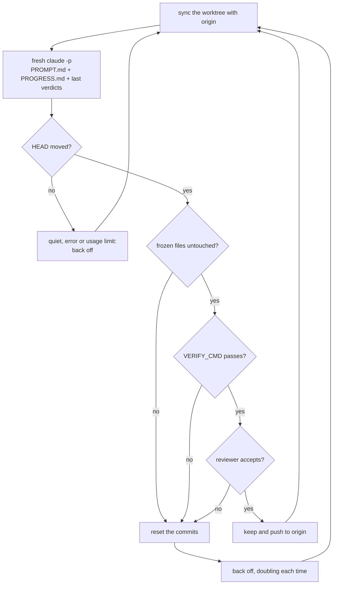

# ralph

[](https://github.com/vkuprin/ralph-harness/actions/workflows/test.yml)

A Ralph loop for Claude Code that runs for days. Every iteration is a fresh
`claude -p`, and git, not the model, decides what shipped.

It is TypeScript on [Bun](https://bun.sh), with no runtime dependencies. It needs
`bun`, `git` and the `claude` CLI (and `bash`, which runs the commands you give it
in the config), and works on macOS and Linux.

```bash
git clone https://github.com/vkuprin/ralph-harness && cd ralph-harness
bin/ralph new audit ~/code/my-app     # scaffold a loop in ~/.claude/ralph/audit
$EDITOR ~/.claude/ralph/audit/PROMPT.md
bin/ralph start audit
bin/ralph status
```

To run it from anywhere, link it onto your PATH. Bun follows the link back to the
checkout, so `git pull` there updates it:

```bash
ln -s "$PWD/bin/ralph" ~/.local/bin/ralph
```

Or let Claude Code set a loop up for you. `skills/ralph-new` is a skill that looks
at the repository, asks how the loop should run (where its work lands, whether its
pull request is merged when it ends, the verify command, the reviewer, when it
stops, the model, its hours, notifications), then runs `ralph new --set …` and
writes `PROMPT.md` with you. Link it once, then say "set up a ralph loop here" in
the repository:

```bash
ln -s "$PWD/skills/ralph-new" ~/.claude/skills/ralph-new
```

## What makes it different

The idea is Geoffrey Huntley's: [Ralph is a bash loop](https://ghuntley.com/ralph/)
that feeds an agent the same prompt until the work is done. There are many
implementations. This one is built for a particular kind of job: open-ended work
with no task list, such as an audit, a clean-up or a measurement campaign, running
unattended on your machine for days.

Every iteration starts with an empty context. Iteration 40 starts as clean as
iteration 1 and reads `PROGRESS.md`, notes a predecessor wrote for a stranger,
instead of dragging a transcript behind it. On the job this was written for (11
iterations over 9 hours, each parsing tens of thousands of selectors across 31
pages), the session that merely *watched* the loop compacted twice. A loop inside
one session would have compacted sooner, and every compaction throws away the
detail the next measurement needs.

The model does not decide what counts. A model that thinks it is finished cannot
end the loop, and one that does nothing shows up in the log within one iteration.
The loop asks git whether HEAD moved. If you let it, it then runs your own check
and a read-only reviewer on the new commits and resets the ones that fail.

An iteration that finds nothing makes the loop look less often. It does not stop
it, because an hour that found nothing says nothing about the next hour.

You can redirect it while it runs. `ralph steer` reaches the iteration in flight
at its next tool call, and every iteration after that, as the text you typed: a
Windows path, a regex or a `\t` goes through to `PROMPT.md` byte for byte.

The cost is worth naming: the agent knows only what the previous one bothered to
write down. `PROGRESS.md` discipline is the whole ballgame, which is why the
template spends most of its words on it.

## Use something else when

| If you want | Use |
| --- | --- |
| a task with an end, finished in the session you are watching | Claude Code's built-in [`/goal`](https://code.claude.com/docs/en/goal) or the official [`ralph-loop` plugin](https://github.com/anthropics/claude-code/tree/main/plugins/ralph-wiggum) |
| a PRD or task list worked through overnight | [snarktank/ralph](https://github.com/snarktank/ralph) or [PageAI-Pro/ralph-loop](https://github.com/PageAI-Pro/ralph-loop) |
| every change to go through a pull request and CI | [Continuous Claude](https://github.com/AnandChowdhary/continuous-claude) |
| one file tuned against one number | [karpathy/autoresearch](https://github.com/karpathy/autoresearch) |
| the loop to run in the cloud on a schedule | [githubnext/autoloop](https://github.com/githubnext/autoloop) |

How they compare on the two things this harness is built around:

| | Each iteration runs in | Who decides a change counts |
| --- | --- | --- |
| official `ralph-loop` plugin | the same session (a Stop hook re-feeds the prompt) | the model prints a completion promise |
| `/goal` | the same session | a small model reads the transcript |
| snarktank/ralph | a new process | the model prints `<promise>COMPLETE</promise>` |
| Continuous Claude | a new process | CI on a PR per iteration; the harness commits everything with `git add .` |
| autoresearch | one long agent session | a frozen metric: keep or revert |
| githubnext/autoloop | a GitHub Actions run, every 6 hours by default | the model compares the metric with the best so far |
| this harness | a new process | git, your `VERIFY_CMD`, and a read-only reviewer |

## How an iteration goes



1. The prompt is `PROMPT.md` (re-read every time, so edits land on the next
   iteration), then `PROGRESS.md`, then the last ten harness verdicts. Where
   `PROGRESS.md` claims something shipped and the verdicts say it was reset,
   the verdicts win. Both files are checked before every iteration, not only at
   the start: if one has gone missing or become unreadable the loop stops and
   says which. Half a prompt is not a prompt — without `PROMPT.md` the next
   agent would be handed its own notes and "Run one iteration now", with no job
   at all. Put the file back and start the loop again.
2. The agent works in its own git worktree on branch `ralph/<name>`, next to your
   repository. It commits; it cannot push.
3. When it exits, the harness throws away anything left uncommitted. An
   uncommitted edit to a frozen file therefore cannot help a commit pass.
4. The new commits go through the gates in order. The first failure resets the
   branch to where the iteration started.
5. Kept commits are rebased onto origin if someone else pushed meanwhile, verified
   again, and pushed by the harness: to `BRANCH` itself with `"PUSH": true`, or
   to `ralph/<name>` for a pull request with `"PUSH": "pr"` (below).
6. Every iteration leaves one row in `results.tsv`, which `ralph results` prints:

| Verdict | Meaning |
| --- | --- |
| `keep` | shipped |
| `keep:unreviewed` | shipped; `VERIFY_CMD` passed but the reviewer gave no verdict |
| `quiet` | nothing committed |
| `ratelimit` | the run hit a limit (5-hour, weekly, credit, overloaded API); the loop waits and tries the same iteration again |
| `timeout`, `error` | the agent was killed after `ITER_TIMEOUT`, or crashed |
| `revert:frozen` | a commit touched a frozen file |
| `revert:verify` | `VERIFY_CMD` failed |
| `revert:review` | the reviewer rejected the change, with its reason |
| `revert:review-unavailable` | no reviewer verdict and no `VERIFY_CMD`, so nothing vouched for it |
| `revert:history` | the agent left `ralph/<name>` or rewrote its history |
| `drop:conflict`, `drop:reverify` | kept work no longer applied, or no longer passed, on top of a new origin; saved under `refs/ralph/dropped/`. Never with `"PUSH": "pr"` |
| `drop:interrupted` | on start: commits from an iteration that was killed before it was judged; saved under `refs/ralph/dropped/` |

Limits heal on their own. When a run ends on a plan limit, an overloaded API or an
API key out of credit, the loop sleeps `RATE_LIMIT_SLEEP` and tries the same
iteration again, as often as it takes. A limited call fails at once without using
quota, so the retries are free, and they do not count toward `MAX_ITER`. With
`LIMIT_RESET` on the loop reads the reset time out of the message instead —
`hit your session limit · resets 9:10am (Europe/Paris)`, `resets Mon 9am` — and
waits until then, plus two minutes, on the clock rather than by counting
seconds, so a machine that sleeps through the wait wakes to the right answer. A
message with no time in it (credit spent, an overloaded API) still waits
`RATE_LIMIT_SLEEP`, and so does a time that has just gone by with the limit
still on: that is a late reset, not tomorrow's. The
reviewer waits the same way instead of letting a commit through unreviewed, but
only `REVIEW_LIMIT_TRIES` times: it waits holding a commit that no gate has
judged, and a limit that never clears (a spent credit balance) would park the
loop on it for good. With `LIMIT_RESET` on that ceiling is counted in seconds,
`REVIEW_LIMIT_TRIES × RATE_LIMIT_SLEEP`: a reset inside it is waited for, and
one past it — a weekly limit — is given up on at once rather than after six
hours of asking. After that the iteration takes the reviewer-unavailable
path above — `keep:unreviewed` if `VERIFY_CMD` vouched for it, otherwise
`revert:review-unavailable`. If
the loop itself is killed (a reboot, `ralph stop` mid-iteration), commits the
unfinished iteration made are set aside at the next start rather than pushed
unjudged.

After `ESCALATE_AFTER` failed or reverted iterations in a row, the prompt tells
the agent to stop retrying and pivot. After twice as many, it tells it to write the
blocker under "Needs a decision" and move on. The loop itself never gives up on
this; it backs off.

`NOTIFY_CMD` is how the loop tells you instead of writing it down where nobody
looks. It is a shell command the harness runs on the events you would otherwise
have to go and find: `stopped` (every way the loop can end), `refused` (a start
that never ran an iteration), `stuck` (`ESCALATE_AFTER` reached), `limit` and
`limit-clear` (the first iteration of a limit streak, and claude answering
again), `decision` — new text under "Needs a decision" in `PROGRESS.md`,
which is the agent handing you a question it cannot settle (a line not there
before; a question settled or moved is not news) — `health` and
`health-clear`, `churn`, and with `"PUSH": "pr"`, `pr` (a pull request opened, with
its URL) and `pr-blocked`, and with `PR_MERGE`, `merged` and `merge-blocked`, all
described below. Not on a keep, and
not on a quiet iteration: a notifier that speaks every iteration is one you stop
reading. The event arrives in the environment — `RALPH_EVENT`, `RALPH_LOOP`,
`RALPH_DIR`, `RALPH_ITER`, `RALPH_MESSAGE` — and never pasted into the command,
so a message holding a quote or a `$(...)` cannot become part of what runs. The
command is bounded by `NOTIFY_TIMEOUT` and its exit status is thrown away: a
notifier is not a gate, and a phone that is off must not be able to hold up, or
stop, the loop. `template/config.json` has a macOS notification and a Telegram
`curl` ready to uncomment. The command runs under `bash -c`. Two things it does
not say: `ralph stop` and a reboot (you did those), and the refusals before
`config.json` is read — a missing or unreadable `config.json` is where
`NOTIFY_CMD` would have been.

Three settings keep a loop pointed and within budget. `DONE_CMD` is your own
check that the job is done, run in the work directory before every iteration and
after the last push: exit 0 stops the loop and notifies `stopped`, so a loop
whose list is finished does not wander off into whatever it finds next.
`"ACTIVE_HOURS": "22-08"` keeps it to the hours you are not using the plan limit it
shares with you; the wait comes between iterations and never counts toward
`MAX_ITER`. `REVIEW_MODEL` puts the reviewer on a cheaper model.

Two sections of the prompt template do the same from the other side. "Done looks
like" is an example or a check of the finished result, not an adjective ("renders
with the brand fonts at 375 and 1440 px", not "a nice landing page"); the
reviewer holds each commit against it, rejecting one that contradicts it or
claims to have met it, never one that is simply a step short of it. "Direction"
is for open-ended loops: what to look for, in which order, and what to leave
alone. Each prompt also lists what the loop shipped recently, from its own kept
commits in git, so an agent sees when it keeps circling one topic.

`HEALTH_CMD` is your check of the running system, not of a commit: run in the
work directory before every iteration, after the sync. `VERIFY_CMD` judges a
commit before it ships; a regression the tests cannot see — a job that stopped
running, notifications that stopped going out — shows only in production
afterwards, and a loop left to itself goes on down its list while it is broken.
One such regression was noticed thirty hours and four iterations after the
commit that caused it. While `HEALTH_CMD` fails, the prompt leads with its last
lines and the commits since it last passed, and tells the agent to fix that
before anything else; `DONE_CMD` is not asked, because a job is not done while
the system it runs is broken; and you hear `health` once when it starts failing
and `health-clear` once when it passes again.

The loop also counts, from git and its own keep rows, which files its recent kept
iterations changed. A file that `CHURN_AT` or more of the last `CHURN_WINDOW`
changed is named in the prompt, with the advice to close the class of defect in
one commit or write down why it keeps breaking and go elsewhere; the reviewer is
told when a commit touches one of them again, and holds it to a higher bar; and
you hear `churn` once for each file that joins the list. Fix after fix in one
place is how one loop spent twelve iterations in a row each closing the gap the
last had left. `CHURN_IGNORE` leaves out files that change with every commit by
design, such as a changelog.

`"PUSH": "pr"` is for a loop nobody is watching. The harness pushes `ralph/<name>` to
origin and keeps one pull request open into `BRANCH`, through `gh` when it is
logged in (without it, the branch is still pushed and the log says to open the
pull request yourself). Nothing pushes `BRANCH`, so the credentials on the box
only need to reach `ralph/*`. Before every iteration the branch is rebased onto
`BRANCH` and verified again, as with `"PUSH": true`, but nothing is ever dropped here:
the unpushed work is everything since the last merge, not one iteration's, and
you are the last gate anyway. A rebase that conflicts, or passes and then fails
`VERIFY_CMD`, leaves the branch on its old base and tells you once
(`pr-blocked`); the pull request shows the conflict. A merge commit, a rebase and
a squash merge all work — for a squash the harness asks `gh` which head was
merged and replays only what came after it — and GitHub deleting the branch after
a merge is expected. Do not push to `ralph/<name>` yourself: the push is leased
on the commit the harness last pushed, so commits it did not make are never
overwritten, and the loop keeps its work local and says so until they are gone.

`"PR_MERGE": true` merges that pull request for you, once, when the loop ends by
itself: `DONE_CMD`, `MAX_ITER`, `QUIET_STOP` or `ERROR_STOP`. `ralph stop` never
merges, because stopping is your call and so is what happens to the work after it.
The harness syncs the branch one last time, then reads the pull request's checks
every `PR_MERGE_POLL` seconds, for up to `PR_MERGE_WAIT` seconds of the machine
being awake. When every check has passed it runs `gh pr merge` with
`PR_MERGE_METHOD` (a merge commit unless you say `"squash"` or `"rebase"`) and
`--match-head-commit`, so GitHub merges exactly the commit the checks ran on and
refuses one that moved. It merges only while the branch sits on `BRANCH` as origin
has it. A branch left on its old base by a conflict or a failed re-verify is never
merged, because nothing checked it on top of `BRANCH`. A pull request with no checks
at all (seen twice, a poll apart, since GitHub can take a moment to register them)
merges on `VERIFY_CMD` alone, and not at all when there is none. A failed check, a
wait that ran out, or GitHub refusing (a required review, branch protection) is
`merge-blocked`, with the reason; a merge is `merged`, with the URL. Both come
before `stopped`. It needs `"PUSH": "pr"` and `WORKTREE`, and a config that sets it
without them is refused at start.

What an iteration costs is in `results.tsv`, after the reason: `cost_usd` and
`tokens` (input plus output, the agent's and the reviewer's together), read from
claude's JSON answer. `ralph review` and `ralph status` total them. On a
subscription the dollars are what the API would have charged, not a bill, and a
run killed before it answered reports nothing, so the total is a lower bound.

## Commands

```bash
ralph                       # a short guide, then the loops you have
ralph new <name> <repo>     # scaffold a loop from template/
ralph new <name> <repo> --set PUSH=pr --set PR_MERGE=true
                            # ...with settings written into its config.json
ralph start <name>          # run it in the background
ralph status [name]         # running or not, iterations, verdict counts, HEAD
ralph review <name> [n]     # what it shipped, what the gates threw away, what waits to merge
ralph results <name> [n]    # the last n verdicts as a table
ralph log <name> [n]        # the last n lines of the log
ralph tail <name>           # follow the log
ralph steer <name> "text"   # redirect it, starting with the iteration in flight
ralph edit <name>           # open PROMPT.md in $EDITOR
ralph migrate <name>        # convert a loop's config.sh, from the bash harness, to config.json
ralph stop <name>           # stop the loop and everything the agent started
```

Loops live in `$RALPH_HOME`, which defaults to `~/.claude/ralph`. The name is not
just a label: it is the directory under `$RALPH_HOME`, and with `WORKTREE` on it is
also the branch `ralph/<name>` the loop commits to. So `ralph new` refuses a name
that cannot be both — anything holding a `/`, and anything
`git check-ref-format --branch` rejects, such as a space, `..`, `~`, `^`, `:` or a
leading dot. What is left still includes characters a shell reads as syntax — `&`,
`;`, `|`, `$`, a backtick, a quote — so every command the CLI prints back for you
to paste quotes the name and the repo path: paste it and it acts on the loop it
names, including the `git merge` that `ralph review` offers you. A loop directory
holds `config.json`, `PROMPT.md` (the job) and `PROGRESS.md` (the memory), plus the
log, the verdicts and the archive the harness writes. None of it goes into your
repository: `PROMPT.md` tends to carry hostnames and per-project rules, and
`PROGRESS.md` grows into a long journal. Only the newest `PROGRESS_KEEP` Log
entries stay in it; older ones move to `PROGRESS-archive.md`, which the agent can
read but which is not put into every prompt. Nothing is dropped on the way: an
entry that leaves `PROGRESS.md` is in the archive, whatever characters the path
to your loop directory holds.

That cap reads a `## Log` heading with `### ` entries under it, and the agent is
what writes both — rename either, or write one enormous entry, and it has
nothing to count. So the bound that matters is on the prompt rather than on the
file: at most `PROGRESS_MAX_BYTES` of `PROGRESS.md` is injected, and the first
bytes are the ones kept, because the newest entry goes at the top. The file
itself is never truncated — it is the loop's whole memory — and the prompt says
where to read the part that was cut. If you see that notice, the entry cap has
stopped working and `PROGRESS.md` wants tidying by hand.

The log is bounded the same way. Every agent's whole output goes into `ralph.log`,
so a loop left running for days would write gigabytes into one file; instead it
rotates between iterations once it passes `LOG_MAX_BYTES`, keeping `LOG_KEEP`
older files as `ralph.log.1` and up. `ralph status`, `ralph log` and `ralph tail`
read the rotated files too, however many there are, so the iteration counts do
not reset when it rotates. Lower `LOG_KEEP` and the files above the new number
are removed at the next rotation, so the total stays where you set it.

`ralph.log` is the whole story: the harness's own errors go there as well, not
only the agent's output, and that includes the ones from before the first
iteration. A loop that cannot start — no `REPO`, a `REPO` that is not a checkout,
a missing `PROGRESS.md` — says why in the log, because `ralph start` puts it in
the background and the CLI has already printed `started <name> as PID N` by the
time it dies. `ralph start` also leaves a `ralph.out` beside it with the progress
lines in it, but nothing you need is there alone.

What the gates throw away is bounded too, and that one grows in your repository
rather than in the loop directory. A reverted or dropped commit is kept under
`refs/ralph/`, and that ref is the only thing left keeping it reachable — so
while they accumulate, `git gc` can never reclaim the objects, and a long run
pins one whole tree per thrown-away iteration for good. The newest `REF_KEEP` of
each kind are kept and the rest are let go, which is all `git gc` needs to shrink
the repository back.

A loop that ends by `kill -9`, the OOM killer or a reboot leaves its `ralph.pid`
and `ralph.lock` behind, and the kernel later hands that number to some unrelated
process. Neither file is believed on the number alone: the process holding it has
to be running this loop, with this loop's directory on its command line, compared
as text and not as a pattern. Otherwise `ralph status` reported a dead loop as
running, `ralph start` refused to start it ever again, and `ralph stop` killed the
stranger's process group. The lock is taken atomically, so two starts at once
cannot both win it.

### Loops from the bash harness

This harness was bash until it was rewritten in TypeScript, and a loop made then
keeps its settings in `config.sh`, which was sourced. The TypeScript harness reads
only `config.json`, so such a loop is listed by `ralph status` with a hint, and
`ralph start` and the loop itself refuse it, naming the command that converts it:
`ralph migrate <name>`. That reads the `config.sh` the way bash did — assignments,
several to a line, quoted any of the three ways bash quotes, and `KEY=( … )` lists
— and writes the same values to `config.json`, keeping the old file as
`config.sh.old`. A line it would have to evaluate, such as `REPO="$HOME/app"` or a
backtick, is refused with the line quoted, rather than guessed at; convert that one
by hand. A setting the file never set keeps the harness default, as before.
`RATE_LIMIT_RE="$RATE_LIMIT_RE|…"` becomes `RATE_LIMIT_EXTRA_RE`. It refuses while
the old loop is still running: stop it with the old harness first. `PROMPT.md`,
`PROGRESS.md`, the log, `results.tsv` and the worktree carry over unchanged, so
the loop goes on where it stopped.

## Configuration

`config.json` in the loop directory is read once at start: a restart is how a
setting changes. It is JSON with `//` comments and trailing commas allowed, and the
key names are the ones in the table. `ralph new` writes one from
`template/config.json`, which documents every setting beside it, with the values
in the first column. A setting left out takes the value in the second — the
harness's default, not the template's — which is how a loop written for an
earlier version keeps behaving the same. Flags are `true` or `false` (`1` and `0`
are read as those too), lists are JSON arrays, and paths are absolute.

A setting the harness could not read is not one you left out. A file that does
not parse, a key it does not know (a typo, say `MAX_ITERS`), or a value of the
wrong type (`"MAX_ITER": "40"`) refuses the start, with the reason in `ralph.log`.
Running on with only the settings it understood is how a loop written for a gated
worktree once ran with `WORKTREE` off and committed into its user's own checkout.

The commands in it — `SETUP_CMD`, `VERIFY_CMD`, `HEALTH_CMD`, `DONE_CMD`,
`NOTIFY_CMD` — are shell text and run under `bash -c` in the work directory. The
repo path `ralph new` writes is a JSON string, so a path holding a `$`, a backtick
or a quote arrives at the loop exactly as it is on disk.

| Setting | `ralph new` | If unset | What it does |
| --- | --- | --- | --- |
| `REPO` | your repo | required | the checkout to work on, as an absolute path |
| `MODEL` | `"opus"` | `"opus"` | model for the agent and the reviewer |
| `MAX_ITER` | `500` | `500` | hard ceiling on iterations |
| `QUIET_STOP` | `0` | `0` | stop after this many silent iterations in a row; `0` never stops. Use `3` for a finite list |
| `QUIET_SLEEP` | `1200` | `1200` | seconds to wait after a silent iteration |
| `STEP_SLEEP` | `30` | `30` | seconds between iterations |
| `ADD_DIRS` | | `[]` | extra directories the agent may read |
| `WORKTREE` | `true` | `false` | work in a harness-owned worktree; every gate needs it |
| `WORKTREE_DIR` | | `<repo>-ralph-<name>` next to the repo | where the worktree goes; a path holding anything but a worktree of `REPO` is refused |
| `BRANCH` | `"main"` | `"main"` | the branch the worktree starts from and pushes to |
| `PUSH` | `true` | `false` | push kept commits to `origin/BRANCH`; with `"pr"`, push `ralph/<name>` and keep one pull request open into `BRANCH`; with `false` they wait on `ralph/<name>` for you. With no `origin` it says so once and behaves as `false` |
| `PR_MERGE` | `false` | `false` | with `"pr"`, merge the pull request when the loop ends by itself, if every check on it passes |
| `PR_MERGE_METHOD` | `"merge"` | `"merge"` | how `PR_MERGE` merges: `"merge"`, `"squash"` or `"rebase"` |
| `PR_MERGE_WAIT` | `3600` | `3600` | seconds `PR_MERGE` waits for checks still running, counted awake |
| `PR_MERGE_POLL` | | `30` | seconds between two readings of the checks |
| `SETUP_CMD` | `""` | | run once in a new worktree (`npm ci`, copy `.env`). If it fails the worktree and its branch go, so the next start runs it again |
| `VERIFY_CMD` | `""` | | your check, run after every commit; failing resets the commit |
| `VERIFY_TIMEOUT` | `1800` | `1800` | seconds `VERIFY_CMD` may take, counted awake |
| `FROZEN` | `[]` | `[]` | paths a commit may not touch |
| `REVIEW` | `true` | `false` | a read-only reviewer judges each commit |
| `REVIEW_MODEL` | | `MODEL` | the reviewer's model; a cheaper one saves the shared plan limit |
| `DENY` | `[]` | `[]` | tool patterns the agent may not use, such as `"Bash(ssh *)"`, each passed as `--disallowedTools`; see Safety |
| `HEALTH_CMD` | `""` | | your check of the running system, run before every iteration; while it fails it leads the prompt and `DONE_CMD` is not asked |
| `HEALTH_TIMEOUT` | `300` | `300` | seconds `HEALTH_CMD` may take, counted awake; a timeout counts as failing |
| `CHURN_AT` | `4` | `0` | name the files changed by at least this many of the last `CHURN_WINDOW` kept iterations to the agent, the reviewer and you; `0` is off |
| `CHURN_WINDOW` | `8` | `8` | how many kept iterations `CHURN_AT` counts over |
| `CHURN_IGNORE` | `[]` | `[]` | pathspecs left out of the count, such as `"CHANGELOG.md"` |
| `DONE_CMD` | `""` | | your check that the job is done, run before every iteration; exit 0 stops the loop |
| `ACTIVE_HOURS` | `""` | | local hours iterations may start in, like `"22-08"` (end excluded, wraps past midnight); empty is any hour |
| `ITER_TIMEOUT` | `7200` | `7200` | seconds one agent run may take, counted awake |
| `RATE_LIMIT_SLEEP` | `1800` | `1800` | wait before retrying after a limit |
| `LIMIT_RESET` | `true` | `false` | wait until the reset time the limit message names instead; a message with none still waits `RATE_LIMIT_SLEEP` |
| `RATE_LIMIT_EXTRA_RE` | | | more that counts as a limit, such as your proxy's message: a regular expression, matched ignoring case, added to the built-in one |
| `RATE_LIMIT_RE` | | see `src/lib/config.ts` | what counts as a limit, replacing the built-in pattern entirely; `RATE_LIMIT_EXTRA_RE` is usually what you want |
| `REVIEW_LIMIT_TRIES` | `12` | `12` | times a limited reviewer is asked again before the iteration gives up on the review; `0` waits forever |
| `ERROR_SLEEP` | `300` | `300` | wait after a failure or reset, doubling in a row up to an hour |
| `ERROR_STOP` | `0` | `0` | stop after this many crashes or timeouts in a row; `0` never stops |
| `ESCALATE_AFTER` | `3` | `3` | failures in a row before the prompt says pivot |
| `NOTIFY_CMD` | `""` | | a command run on the events above; the event is in `RALPH_EVENT`, `RALPH_LOOP`, `RALPH_DIR`, `RALPH_ITER` and `RALPH_MESSAGE`. Empty is silence |
| `NOTIFY_TIMEOUT` | `30` | `30` | seconds `NOTIFY_CMD` may take, counted awake; its exit status is ignored either way |
| `PROGRESS_KEEP` | `8` | `8` | Log entries kept in `PROGRESS.md`; `0` keeps all |
| `PROGRESS_MAX_BYTES` | `120000` | `120000` | most of `PROGRESS.md` put into one prompt, first bytes kept; the file is never touched; `0` injects all of it |
| `LOG_MAX_BYTES` | `10000000` | `10000000` | rotate `ralph.log` once it passes this between iterations; `0` never rotates |
| `LOG_KEEP` | `3` | `3` | rotated logs kept, `ralph.log.1` up, no ceiling; lowering it prunes the rest; `0` throws the old one away |
| `REF_KEEP` | `20` | `20` | thrown-away commits kept under `refs/ralph/reverted/` and `refs/ralph/dropped/`, newest first, each counted separately; `0` keeps every ref and `git gc` can never reclaim them |
| `POLL_GAP_MAX` | | `60` | longest gap between two polls of a running command that still counts against its timeout; a longer one is the machine having been suspended. Not an opt-out: `0` or less falls back to `60` |
| `ACTIVE_POLL` | | `300` | seconds between looks at the clock while waiting for `ACTIVE_HOURS` or a limit's reset |
| `LIVE_STEER` | `true` | `true` | let `ralph steer` reach the iteration in flight |
| `CLOSING` | | names the loop's `PROGRESS.md` | the last line of every prompt |

Two settings matter more than the rest. `VERIFY_CMD` is the strongest gate you
can give the loop, because it is a check you own and the model cannot edit. Put
the measurement script and the fixtures it reads in `FROZEN`, or the agent can
pass the check by moving it. `MAX_ITER` is the one thing standing between a bug
in your prompt and a loop that runs all week.

## Safety

The agent runs with `--dangerously-skip-permissions`: it can run any command your
user can. The harness narrows what that can do to your code, not to your machine.

- With `WORKTREE` on it never touches your own checkout, and everything that
  resets commits happens only inside its own worktree. A `WORKTREE_DIR` that
  holds a checkout of some other repository is refused at start rather than
  reset: the loop only discards work on a worktree of its own `REPO`.
- With `PUSH` on the agent's own push to this repository fails, however it
  spells it; only the harness pushes, and only what passed the gates.
  `"PUSH": "pr"` never pushes `BRANCH`, so an unattended box can hold a deploy key
  that cannot push `main` at all; protect `main` on the host as well. The block is keyed
  on the remote's URL, so a push to some other repository — the throwaway remote
  a test suite makes for itself, say — still works.
- `DENY` turns tool patterns into `--disallowedTools` flags, which claude
  enforces ahead of `--dangerously-skip-permissions`: checked with a real call,
  where `Bash(touch *)` was refused under skip-permissions and allowed without
  the rule. It guards against accidents, not against an agent set on getting
  round it (`bash -c`, a script), so keep production credentials out of the
  loop's reach as well.
- The reviewer runs with `claude -p --restricted --tools "Read,Grep,Glob"`: no
  shell, no settings or MCP servers from your machine or from the repository, and
  permission prompts are denied rather than left hanging.
- Every run (agent, `VERIFY_CMD`, reviewer, push) has a timeout and its own
  process group, so a timeout or `ralph stop` also ends the test runners and dev
  servers it started.
- `ralph steer` reaches a running agent through a PreToolUse hook that denies its
  next tool call with the steer as the reason. It is a convenience channel, not a
  trust boundary: the agent can write that file too.
- The agent can write in the loop directory — it is told to rewrite
  `PROGRESS.md` there — so it can also take `PROMPT.md` away. It is read again
  before every iteration, and a loop with no job stops instead of running an
  unprompted agent. The reviewer reads it for the job it judges against, so with
  it gone the reviewer is not asked at all: that iteration takes the
  reviewer-unavailable path rather than an ACCEPT that means nothing.

`HEALTH_CMD`'s output goes into the prompt of an agent that runs with
`--dangerously-skip-permissions`, so have it print your own check's findings and
not text from pages or users it measures; the same goes for anything else the
agent reads. A loop that reads third-party content can be handed instructions
in it: keep root keys and write access to production off the machine it runs on.

If the loop can reach production, say in `PROMPT.md` what it must never write
to. For stronger isolation, run the whole thing inside a container or a VM.

## Tests

```bash
bun install
bun run check                          # typecheck, then every test
bun test tests/unit                    # the parsers and bounds, in seconds
bun test tests/e2e/gates.test.ts       # one end-to-end file
RALPH_REAL_CLAUDE=1 bun test tests/contract   # against the real claude CLI (a few cents)
```

A stub stands in for `claude` and `gh`, and a bare repository for origin, so the
unit and end-to-end tests need no network and no credentials. The end-to-end tests
drive the real loop and CLI as processes through every verdict above, the CLI, the
escalation, the bounds, limits and resets, suspend, notifications, the steering
hook and the pull-request flow. Each test file runs in a temporary directory with
its own HOME and git config, so nothing it starts can reach your own loops. CI runs
them on Linux, and on macOS once the repository is public.

The contract tests are the one place the real CLI is called: they check that
`claude` accepts every flag the harness passes, answers in the JSON it reads, and
honours the steer hook's answer. The stub accepts anything, so nothing else would
notice if the CLI changed underneath.

Every check is about that run's own processes and its own temporary directory,
so an unrelated `sleep 999` in another terminal — or a second copy of the suite —
cannot fail it. The run proves that as it goes: it starts two such processes of
its own and leaves them running throughout. This matters because `bun run check`
is what a loop working on this repository hands to `VERIFY_CMD`, and a check that
goes red for a reason outside the commit resets work that was fine.

## Credits

- [Geoffrey Huntley](https://ghuntley.com/ralph/) for the technique.
- [karpathy/autoresearch](https://github.com/karpathy/autoresearch) for
  keep-or-revert against a check the agent cannot edit.
- [Continuous Claude](https://github.com/AnandChowdhary/continuous-claude) for the
  reviewer pass and worktree ideas.
- [anthropics/cwc-long-running-agents](https://github.com/anthropics/cwc-long-running-agents)
  for the steering hook; `hooks/steer.ts` is adapted from it (Apache-2.0).
- [ralph-tui](https://github.com/subsy/ralph-tui) for keeping only recent progress
  in the prompt.
- [tcc-autoresearch](https://github.com/the-cloud-clockwork/tcc-autoresearch) for
  escalating after repeated failure.
- Anthropic's [Effective harnesses for long-running agents](https://www.anthropic.com/engineering/effective-harnesses-for-long-running-agents),
  which describes the same progress-file-plus-git design.

## License

MIT, except `hooks/steer.ts` (Apache-2.0). See [LICENSE](LICENSE).
